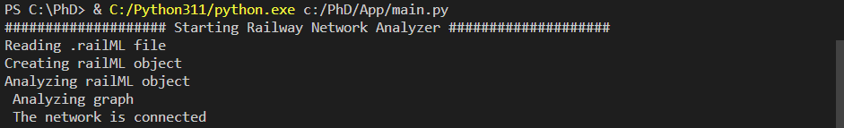

# Example 2

## Description

Name: SimpleExample.railAID

## Step by step

The signalling generation process used in this work was designed following signalling principles defined by Transport for New South Wales (TfNSW). These principles are based on the concepts defined by the Institution of Railway Signal Engineers (IRSE), the Rail Industry Safety and Standards Board (RISSB). These principles include: 

(P1) Having a limited right-to-use (henceforth ”authority”) to one rail element or set of elements.

(P2) Allowing/Denying movement authorities unambiguously.

(P3) Warning train drivers about dangers with enough time to react.

(P4) Enough granularity to support train operations.

(P5) Warning train drivers about the end of the network.

(P6) Waning train drivers about any movable infrastructure such as switches or level crossings or static such as platforms.

(P7) Avoiding train blocking facilities or branches whenever it is possible.

### A. Import the railway layout description

Its imports a railway network without signalling from: C:\PhD\RailML\Layouts\Example_2\Example_2.railml

The necessary information to define the graph network is distributed across several sections of the railML file, specifically inside netElements (nodes) and netRelations (edges) items found in the class Infrastructure/Topology.

### B. Define a graph network to associate the railway elements

The positional information found there can be used to identify straight tracks and curves.

A railway network can be defined as a set of rail tracks that are connected to each other. Only the networks that fulfil the following rules will be considered a valid railway network for the current specification of the RNA, otherwise, the network will be rejected and the analysis will be aborted:

- Every track is defined between two points.
- Two tracks with a common point are connected.
- Each track is connected at least at one of its ends to
another track or a switch.
- The length of a track is within a minimum and a maximum given value.
- A connected region is made up of at least 3 tracks (we
named it a “zone”).
- There is at least one zone in the railway network.
- Two zones connected with a track make one zone.

The result of this step is: 

### C. Reveal additional railway element functionality by infraestructure analysis

The possible elements to detect are borders (which indicates that the railway network continues in some other railway network that is not included in the railML file under analysis), buffer stops (end of the network), derailers, level crossings, lines (rails between stations), operational points, platforms (stations), signals, switches (ordinary switches), tracks and detection elements (axle counters, rail joints and track circuits).

Based on the analysis of the graph network we know how many switches and borders are there and where they are located. Then, it can be assessed if the information in the infrastructure schema is coherent or if there is any missing or corrupted data in a given tag of the railML file. If the number of switches predicted by the
graph network analysis and the number of switches defined in the railML file are not the same, then some data is missing, corrupted or wrong, but if both numbers are equal then the data is consistent. This information is logged in a .rna file that is generated once all this algorithm is concluded. Similar .rna files are generated after concluding the remaining steps. These files can be used to debug the process and are useful to identify inconsistencies and errors in the railML file.

Note that this assessment cannot be done with elements such as level crossings, platforms or detection elements that are associated with a single netElement, because their existence and position cannot be deduced from the topology of the railway network.

### D. Detect CDL zones

It is necessary to protect the CDL zones using signals to avoid trains from moving into this zone without prior permission (P1). The places where signalling is to be located, named hereafter “signalling locations”, can be established at a safe distance from the CDL zone, at the last position before a curve or, if no CDL zone is identified, at the midpoint away from all the railway elements.

The result of this step is: 

### E. Generate signalling

**Signals generated due to line borders(L) and buffer stops(T):**

Signals are enumerated since 00 with a prefix letter to indicate which element generates them. BufferStops and LineBorders signals start with T and L respectively. In Figure 4 we can visualize some of the signals generated by applying algorithm 3.

The RNA allocates signals close to the buffer stops: 

-- Stop: *T01*

-- Departure: *T02*

The RNA allocates signals close to the line borders: 

- Departure signals: *L03, L04, L05 and L06* are assigned close to every line border that belongs to a netElement whose track is longer than a configurable fixed length. 

**Signals generated due to line borders(L),buffer stops(T) and rail joints (J):**

The algorithm not assigns signalling at the beginning and end of each track, because this network not have rail joints as shown in Figure 5. 

**Signals generated due to line borders(L),buffer stops(T),rail joints (J), platforms(P) and level crossings(X):**

Notice that RNA can be configured to avoid adding this signalling when the level crossing and the platform are close together and therefore the signalling between them is not necessary.

In Figure 6 shown the signals:

- Generated due level corrsings: *X07 and X08*.

It is necessary to introduce signals before the train reaches the level crossing as explained in Algorithm 5.

- Generated due platforms: *P09, P10, P11 and P12*.

A railway platform is where the passengers wait for trains to arrive and depart. It is necessary to have a departure signal
after the platform. This is implemented using Algorithm 6.

**Signals generated due to line borders(L),buffer stops(T),rail joints (J), platforms(P),level crossings(X) and switches(S,H,C,B):**

Every switch has three characteristic branches: start, continue and detour branch. Start branches need a departure signal and a manoeuvring signal to allow movements to the continuing branch and a detour branch respectively. Continue and detour branches have the same signals but in the opposite direction, allowing trains to return to the start branch. This is defined in Algorithm 7 and then in Figure 7 is applied on every switch of thid  example. 

The signals for switches are named based on the point they want to protect: S for Starting branch, C for the Continue branch and B for the Detour branch.  However, there are other signals named with H that are not protecting explicitly any of the three points switches have.

Signals generated for

- Sw01:*C13, B14, S18 and H19*.
- Sw02:*C17, S15 and H16*.
- Sw03:*C20, S21 and H22*.

### F. Simplify signalling

The signal simplification process used by RNA relies on two main principles: i) vertical inheritance: related to signalling in topologies where a second switch starts at the same netElement where a previous switch had a detour, and ii) horizontal inheritance: related to signalling of elements that are very close to each other (i.e. railway crossings and platforms, as discussed above). These algorithms might combine signals or move signals farther away before any CDL zone to give train drivers an earlier warning notice than in the original layout (P3, P4, P7).

After generating all the signalling, a simplification should be made to keep only the appropriate signals, as shown in Figure 8:

### G. Export a resulting railway layout description

Once the signalling is generated and simplified, it is necessary to establish the railway routes to create the railway interlocking table. A railway route is the simplest path between two consecutive signals in the same direction, using the same tracks. 

#### Original table

| Route  | Entry | Exit | Switches | Platforms | Crossings | netElements |
|  :---:  |  :---:  |  :---:  |  :---:  |  :---:  |  :---:  |  :---:  |
| R_01 |  S07  |  S11  | Sw01_N  | - | - | ne14-ne16 |
| R_02 |  S08  |  S11  | Sw01_R  | - | - | ne15-ne16 |
| R_03 |  S09  |  S12  | Sw02_N  | - | - | ne18-ne16 |
| R_04 |  S10  |  S13  | Sw03_N  | - | - | ne20-ne19 |
| R_05 |  S10  |  S12  | Sw03_R + Sw02_R  | - | - | ne20-ne17-ne16  |

#### Generated table

| Route  | Entry | Exit | Switches | Platforms | Crossings | netElements |
|  :---:  |  :---:  |  :---:  |  :---:  |  :---:  |  :---:  |  :---:  |
| R_01 |  P10  |  S18  | Sw01_N  | - | - | ne14-ne16 |
| R_02 |  B14  |  S18  | Sw01_R  | - | - | ne15-ne16 |
| R_03 |  P11  |  S15  | Sw02_N  | - | - | ne18-ne16 |
| R_04 |  S21  |  T01  | Sw03_N  | - | - | ne20-ne19 |
| R_05 |  S21  |  S15  | Sw03_R + Sw02_R | - | - | ne20-ne17-ne16 |

Extra routes considering bidirectional tracks:

| Route  | Entry | Exit | Switches | Platforms | Crossings | netElements |
|  :---:  |  :---:  |  :---:  |  :---:  |  :---:  |  :---:  |  :---:  |
| R_06 |  S15  |  P09  | Sw01_N  | - | Lc01 | ne16-ne14 |
| R_07 |  S15  |  L04  | Sw01_R  | - | Lc01 | ne16-ne15 |
| R_08 |  S18  |  P12  | Sw02_N  | - | Lc01 | ne16-ne18 |
| R_09 |  T02  |  L06  | SW03_N  | -  | - | ne19-ne20 |
| R_10 |  S18  |  L06  | Sw02_R + Sw03_R  | - | Lc01 | ne16-ne17-ne20 |

Routes 1 to 5 are the same in both interlocking tables, but RNA considers tracks as bidirectional while the original layout has only one direction per track. Routes 6 to 10 are the opposite of routes 1 to 5. It does not affect safety, RNA always considers every possible route in the layout. What is more, departure signal are considered for line borders and buffer stops for extra protection.
